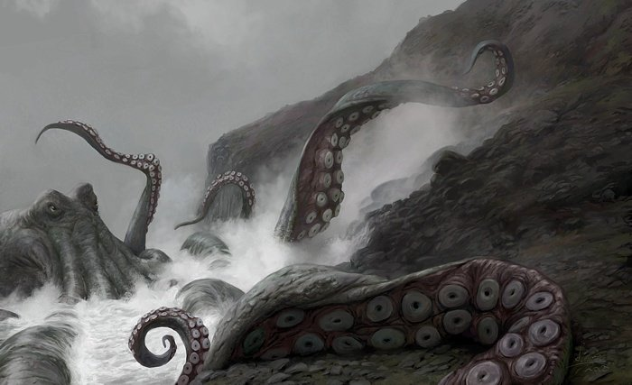

# Kraken

Kraken is a parallelised web crawler written in Go

## Usage

	* go get github.com/mattheath/kraken
	* kraken -target="http://example.com"

Kraken will output a standard XML sitemap and a richer JSON description with links and static assets per page into the current directory (output directory can be overridden, see below).

### Options

Kraken takes a number of command line flags:

	* -target="http://example.com" - The site to crawl
	* -depth=4                     - Depth of links to follow
	* -v                           - Enable verbose logging
	* -o                           - Specify output directory

## Implementation

On start, Kraken fires up a `crawler` which acts as a coordinator, spawning worker goroutines for each link on each page it encounters, which return their results back to the crawler via channels. This allows Kraken to crawl a large number of pages in parallel, though there is currently no upper bound on the number of these.

The crawlers retrieve links and a list of static assets used on each page. This is currently not configurable, but will be implemented in the future. Link mappings _are_ stored, so a list of edges and nodes is available.

## Roadmap

 - [ ] Limit the number of concurrent goroutines, currently this runs as fast as possible
 - [ ] Retry failed page loads with exponential backoff
 - [ ] Allow customisation of resources extracted from pages
 - [ ] Listen on HTTP port and serve back site description
